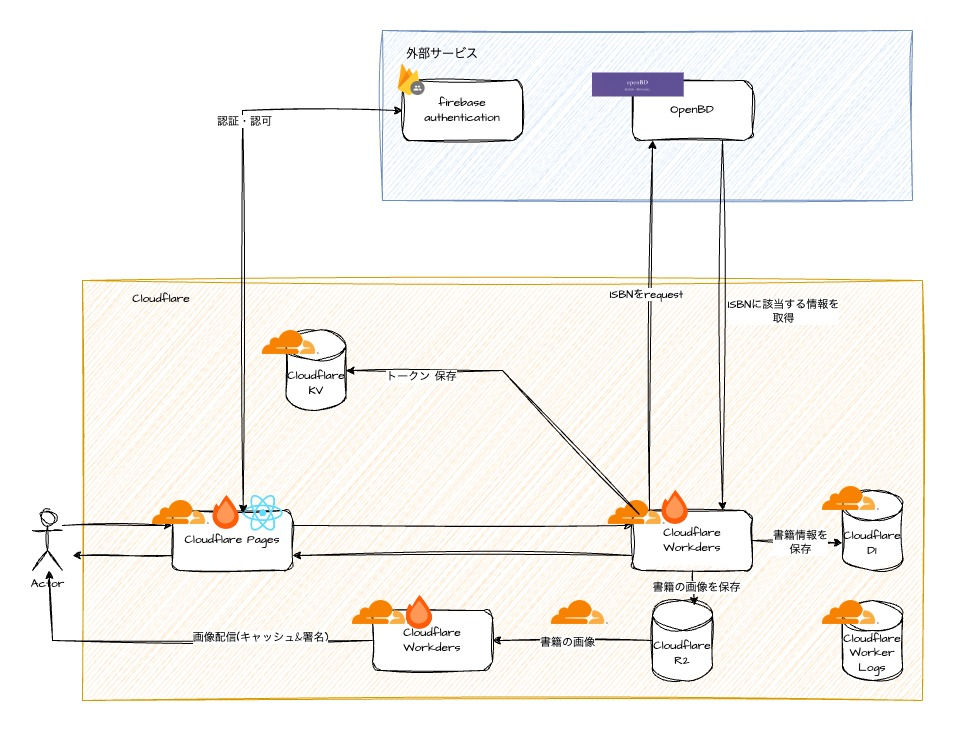

# ハイパーライブラリアン(蔵書管理システム)
購入した書籍を管理するWebアプリです。
バックエンドの勉強も兼ねているので、最終的なシステム構成はアプリの規模にしてはオーバーです。

## Usage

## 技術スタック
### 言語
- TypeScript

### ライブラリ・フレームワーク
- React
- Hono
- Drizzle ORM
- BullMQ

### インフラ
- Cloudflare Pages
- Cloudflare Workers
- Cloudflare D1
- Cloudflare R2
- Cloudflare KV
- firebase authentication
- upstash Resis

### 外部サービス
- OpenBD

## ディレクトリ構成

## マイルストーン
### ⬜️フェーズ1
#### 機能要件
- ユーザ登録、ログインができる
- 画面上から書籍を登録できる(書籍の画像は登録されない)
- csvによる登録ができる
- request→データ登録→responseの順で処理する(メッセージキューなどは使用しない)

#### 構成図

#### 技術調査
- [x] Cloudflare Pages
- [x] Cloudflare Workers
- [x] Cloudflare PagesのFE + Cloudflare WorkersのBEの疎通
- [x] Cloudflare D1
- [x] Cloudflare WorkersとCloudflare D1の疎通
- [ ] Firebase Authentication
- [ ] Firebase Authenticationによる認証の流れの把握
- [ ] OpenBDとの疎通

### ⬜️フェーズ2
#### 機能要件
- フェーズ1の内容
- 書籍の画像が登録される(画像はOpenBDから取得)

#### 構成図

#### 技術調査
- [ ] Cloudflare R2
- [ ] loudflare R2への画像のアップロード
- [ ] Cloudflare R2からの画像配信

### ⬜️フェーズ3
#### 機能要件
- フェーズ2の内容
- 画像配信として署名付きURLを使用する
- 画像配信をキャッシュする
- 画像サイズを最適化する

#### 構成図

#### 技術調査
- [ ] 署名付きURL
- [ ] Cloudflare Workersを使用した画像のキャッシュ
- [ ] Cloudflare Workersを使用した画像のリサイズ
- [ ] Cloudflare Workersを使用した画像の署名付きURLの作成

### ⬜️フェーズ4
#### 機能要件
- フェーズ3の内容
- メッセージキューを導入する。データ登録処理はconsumerに移譲する。
- キューへのqnqueue、データ登録までの一連の流れをjobと呼び、画面上から追えるようにする。

#### 構成図

#### 技術調査
- [ ] メッセージキュー
- [ ] upstash Redis
- [ ] upstash RedisとCloudflare Workersの疎通
- [ ] bullMQ

### ⬜️フェーズ5
- なんかいい感じに機能拡張(インフラ構成は多分変えない)

